# Robotics Project for VIBOT M2 2022 

## Project Goal

The project goal is to implement a lane following method using Autorace 2020 challenge package. This repo contains only lane following packages of that repo with the code explanations.

Some changes applied on the forked AutoRace package and in this file, the last version of the code is explained. If you would like to know more about the experiments we did, the results we obtained and how we ended up with this final version, please refer to the <b> presentation </b> found in this repo.

## Hardware and Software Tools

Software:  
ROS version : Melodic   
Linux version : 18.04.6  
https://github.com/ROBOTIS-GIT/turtlebot3_autorace_2020 

Hardware:  
TurtleBot3 Burger 

## Contents 

Camera calibration  
Lane Detection using Turtlebot3

## Camera Calibration

### Camera Imaging calibration

Determining basic image view parameters like contrast, sharpness, brightness ​etc

Following commands should be run for this step:

roscore  ( <i> on remote pc </i>)  
roslaunch turtlebot3_autorace_traffic_light_camera turtlebot3_
autorace_camera_pi.launch  (<i> on robot </i>)  (to open Turtlebot's camera)

rqt_image_view  ( <i> on remote pc </i>) (<b> camera/image/compressed </b> topic should be chosen)  
rosrun rqt_reconfigure rqt_reconfigure  (<i>on remote pc</i>)  

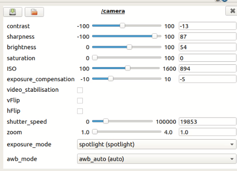

This parameters was saved in <b> turtlebot3_autorace_camera/calibration/camera_calibration </b>  folder as <b>  camera.yaml </b>

Output image view (which distinguishes the yellow and white lane in a good way) obtained with these parameters:

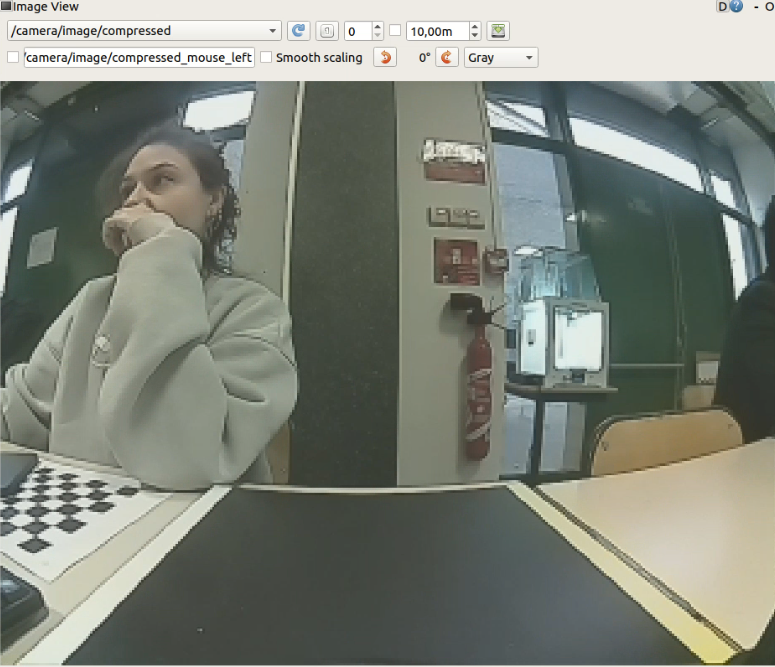

### Camera Intrinsic calibration

Determining intrinsic camera parameters of Turtlebot3 like focal lengths, principal points, distortion coefficients etc.

Following commands should be run for this step:

roscore  (<i>on remote pc </i>)    
roslaunch turtlebot3_autorace_traffic_light_camera turtlebot3_
autorace_camera_pi.launch  (<i>on robot</i>) 

(<i>on remote pc in a new terminal</i>)

export AUTO_IN_CALIB=calibration   
export GAZEBO_MODE=false  
roslaunch turtlebot3_autorace_traffic_light_camera turtlebot3_autorace_intrinsic_camera_calibration.launch  

Main launch file uses http://wiki.ros.org/camera_calibration/Tutorials/MonocularCalibration package to calibrate intrinsic parameters of the robot using a checkerboard 

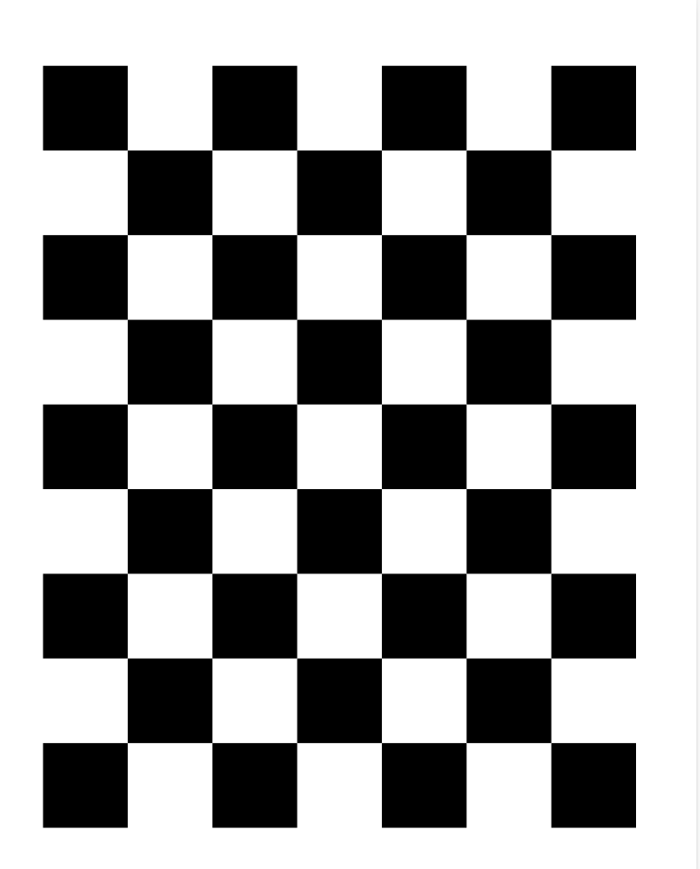

The checkerboard should be moved vertically for the x axe and horizontally for the y axe. It should be moved closer and farther for the size and for the skew it should be orientated in different directions. After obtaining enough amount of translation and orientation, all the variables turn green which means its ready to be calibrated after clicking on the Calibrate button to obtain. The intrinsic camera parameters which are saved
to <b> /tmp/calibrationdata/ost.yaml </b>file is replaced with the
<b> turtlebot3_autorace_camera/calibration/intrinsic_calibration/camerav2_320x240_30fps.yaml </b> file.

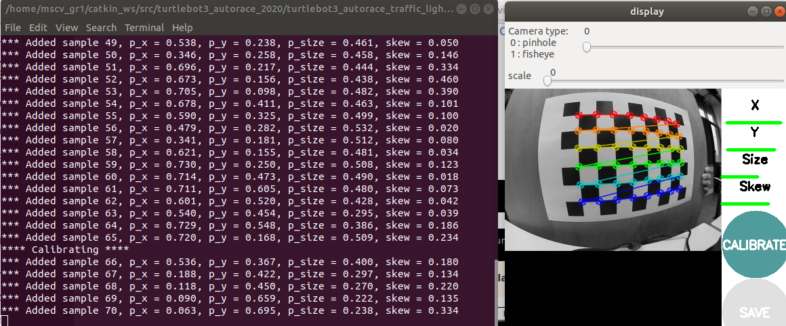  

 

camerav2_320x240_30fps.yaml:   
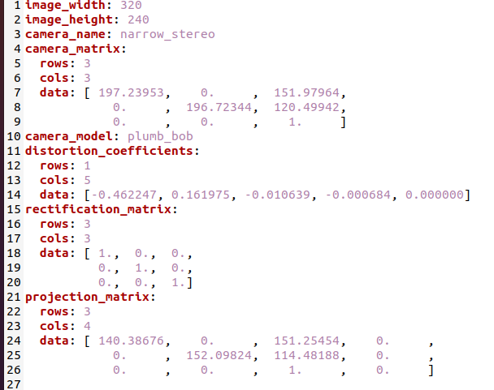

### Camera Extrinsic Calibration

To obtain a better view for the lanes, extrinsic camera calibration is applied to obtain a projected and compensated version of the image.

Following commands should be run for this step:

roscore  (<i>on remote pc</i>)    
roslaunch turtlebot3_autorace_traffic_light_camera turtlebot3_
autorace_camera_pi.launch  (<i>on robot</i>) 

(<i>on remote pc in a new terminal</i>)  
export AUTO_IN_CALIB=action  
export GAZEBO_MODE=false  
roslaunch turtlebot3_autorace_traffic_light_camera turtlebot3_autorace_intrinsic_camera_calibration.launch    

<b> !! </b> Please make attention that intrinsic camera calibration is requested for extrinsic calibration step but the command is run now in <b> action mode 
</b> not <b> calibration </b>

(<i>on remote pc in a new terminal</i>)    
export AUTO_EX_CALIB=calibration  
roslaunch turtlebot3_autorace_traffic_light_camera turtlebot3_autorace_extrinsic_camera_calibration.launch  

rqt (<i>on remote pc</i>) (<b>camera/image_projected_compensated topic </b> and <b> camera/image_extrinsic_calib/compressed </b> topic should be chosen)  
 

rosrun rqt_reconfigure rqt_reconfigure (<i>on remote pc</i>) 

Extrinsic Camera Calibration launch file basically runs two source code named <b> image_compensation.py  </b> and <b> image_projection.py </b>

* #### Image Compensation

Image Compensation is a step to scale the image brightness contrast of com-
pressed image according to the <b> clip_hist_percent </b> parameter we define. To see only the effect of this parameter, <b> camera/image_compensated </b> topic should be chosen in rqt image view.  

Between <b> 90.- 115. lines in image_compensation.py  </b>, using this parameter, a range is calculated to use with cv2.convertScaleAbs function where if clip_hist_percent is different from 0, cumulative histogram of the image otherwise directly the minimum and maximum intensity values are used for these range calculation.

As a result, the image gets brighter and has less contrast with a higher clip_hist_percent value.

* #### Image Projection

Image Projection is the step to project the image using Homography Matrix to obtain a better view for lanes where the camera of the robot look straight as default and we need a view from top. So we bascially extract better ROI as an output (projected) image at this step. As known, 3x3 Homography Matrix is the transformation matrix between the planes having same dimensions.

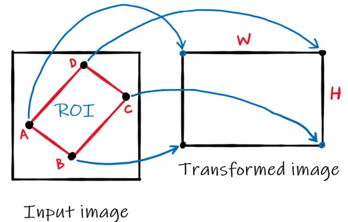  

Since it'is a 8 DOF transformation, this calculation requires at least 4 point pairs. 

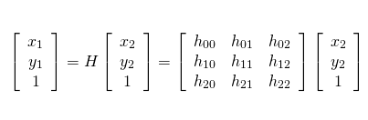  

4 source points are calculated by the parameters top x, top y, bottom x, bottom y we determine while the 4 destination points are determined stable in the code which gives us the necessary pairs. Note that these 4 parameters are used to calculate 4 source points, they are not directly used as 4 source points. 

Source and destination points are calculated betweek 118. - 121. lines in image_projection.py file as follows:

 <b> pts_src = np.array([[160 - top_x, 180 - top_y], [160 + top_x, 180 - top_y][160 + bottom_x, 120 + bottom_y], [160 - bottom_x, 120 + bottom_y]])

</b>

selecting 4 points from image that will be transformed  

<b> pts_dst = np.array([[200, 0], [800, 0], [800, 600], [200, 600]])  </b>

Then cv2.findHomography() function is used with these source and destination point and cv2.warpPerspective() function to apply the Homography matrix comes from findHomography function.

In extrinsic_camera_calibration.launch file, it's seen that in camera/image_projected_compensated topic, we see the output images after appyling both compensation and projection where the compensation is applied to the image published in image_projected/compressed. 

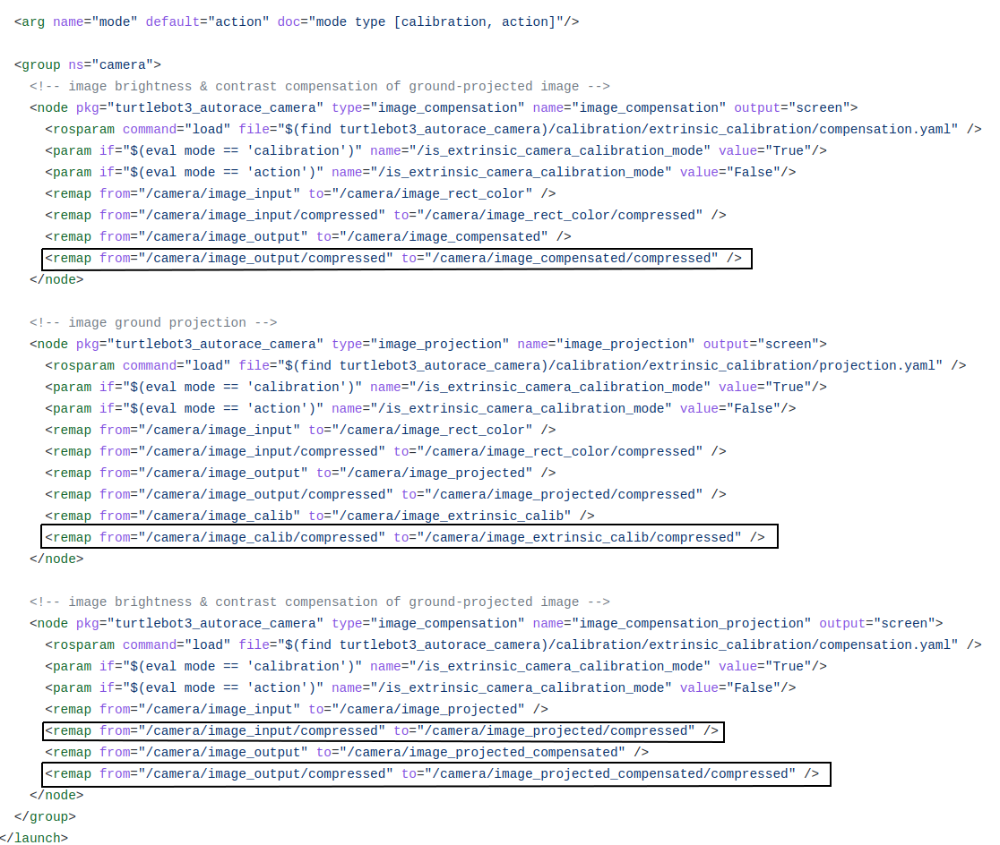  

The final parameters and result of our extrinsic calibration is as follows:

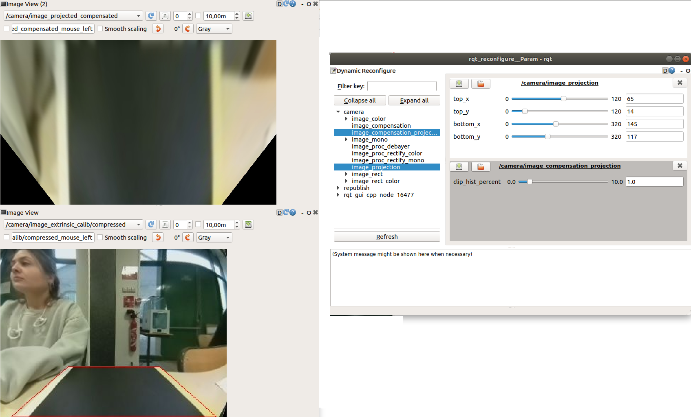  

 

The final parameters should be saved in <b> turtlebot3_autorace_camera/calibration/extrinsic_calibration/projection.yaml  </b> and <b> turtlebot3_autorace_camera/calibration/extrinsic_calibration/compensation.yaml </b> files.

### Lane Detection Calibration

In this step the HSV values for yellow and
white lanes should be determined to create binary masks from the imaging, intrinsic and extrinsic calibration applied image. 

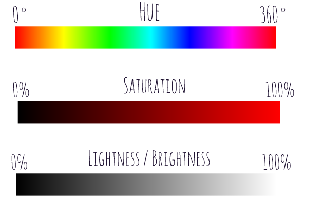  

Hue: Dominant wavelength of the visible spectrum​

​Saturation: The amount of white light mixed with a hue. High-​saturation colors contain little or no white light.​

Lightness: The amount of white pixels mixed in with the color

Accordingly, we can make an assumption that optimal white color should
have 0 hue, 0 saturation and %100 lightness, while a yellow color may have 60 hue , %100 saturation and %50 brightness. Of course since the daily light in the lab is not that "optimal", we ended up with different parameters which have the similar proportions with these hsv values.

We start launching intrinsic and extrinsic calibration programs in
action mode and use the following commands:

roscore  (<i>on remote pc</i>)    
roslaunch turtlebot3_autorace_traffic_light_camera turtlebot3_
autorace_camera_pi.launch  (<i>on robot</i>) 

(<i>on remote pc in a new terminal</i>)  
export AUTO_IN_CALIB=action  
export GAZEBO_MODE=false  
roslaunch turtlebot3_autorace_traffic_light_camera turtlebot3_autorace_intrinsic_camera_calibration.launch    

(<i>on remote pc in a new terminal</i>)    
export AUTO_EX_CALIB=action  
roslaunch turtlebot3_autorace_traffic_light_camera turtlebot3_autorace_extrinsic_camera_calibration.launch  

(<i>on remote pc in a new terminal</i>)   
export AUTO_DT_CALIB=calibration  
roslaunch turtlebot3_autorace_traffic_light_detect turtlebot3_autorace_detect_lane.launch

(<i>on remote pc in a new terminal</i>)  
rqt  ( <b> /detect/image_yellow_lane_marker/compressed, /detect/image_lane/compressed, /detect/image_white_lane_marker/compressed </b> topics should be chosen)  
 
(<i>on remote pc in a new terminal</i>)  
rosrun rqt_reconfigure rqt_reconfigure

Our final parameters with yellow line, white lane masks and output image with the center line to follow, calculated using these two lines.

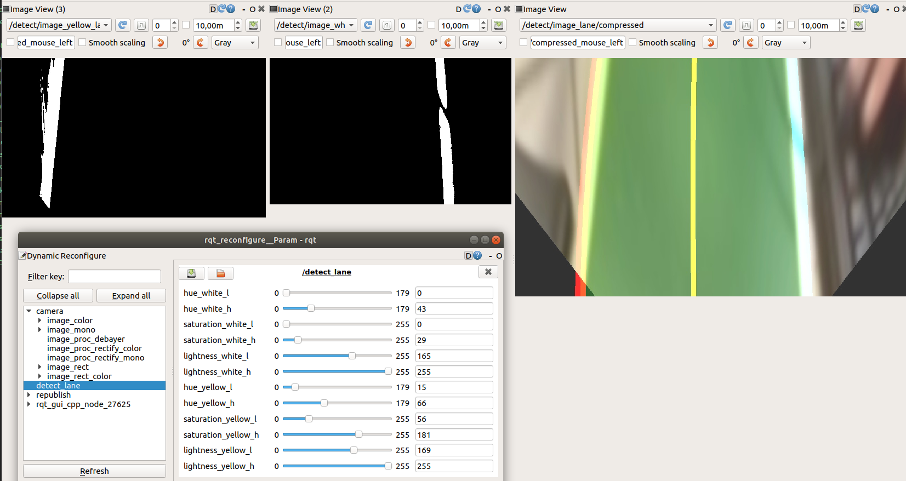  

These parameters are saved in <b> turtlebot3_autorace_detect_lane/param/lane.yaml  </b>  file.

turtlebot3_autorace_detect_lane.launch file uses turtlebot3_autorace_detect_lane/nodes/detect_lane.py source file. The same file is used in action mode while using Turtlebot3 to follow the lane detected. Therefore we prepared a documentation about this source file.

* ### Detect Lane Source File Documentation

<b> class DetectLane </b> --> main class of the module having all the necessary functions inside

<b> class DetectLane init() </b> --> class constructor where the hsv parameters for both white and yellow lane are loaded from lane.yaml file. 

If it's run in calibration mode, the parameters from cfg/DetectLaneParams.cfg are loaded and we can start observing the effect of different parameters to obtain an optimal mask view for both yellow and white lane. Publishers and Subscribers are created to use in next steps. 

The following 2 variables are to store the reliability scores of yellow and white lane detected calculated for each image coming from camera/image_projected_compensated topic. 

self.reliability_white_line = 100  
self.reliability_yellow_line = 100

According to these parameters whether to use or not these lanes to calculate the center lane to follow will be decided in the next steps.

<b> class DetectLane cbGetDetectLaneParam </b> --> If it's run in calibration mode, the parameters from cfg/DetectLaneParams.cfg are loaded using this function

<b>  class DetectLane maskWhiteLane </b> --> Using the lane calibration parameters, this function creates lower and upper boundaries to use cv2.inRange() function to create a mask with these values. Then it uses cv2.bitwise_and() in order to apply this mask to our image which gives a binary image having 1 for the pixels inside this range and 0 for others. 

After obtaining the mask, the pixel numbers having value 1 is counted in fraction_num variable. Then this count is checked whether bigger than 35000 to automatically update the lower lightness value by adding 5 or lower than 5000 to automatically update the lower lightness value by substracting 5 to obtain a bigger range for this parameter.

As another control, if a column in this white lane mask has less lack of 1 values more than 100, self.reliability_white_line variable decreases by 5 otherwise increases by 5.

fraction_num variable and the white mask applied image is returned as the output of the function

<b>  class DetectLane maskYellowLane </b> --> The same process with maskWhiteLane function is followed for yellow lane detection.

<b>  class DetectLane cbFindLane </b> --> Bridge function which gets the results from maskWhiteLane() and maskYellowLane() functions applied on normalized version of camera/image_projected_compensated image and call make_lane() function to obtain the lane to follow. 

After obtaining yellow and white lane pixels from maskWhiteLane and maskYellowLane functions, self.left_fitx and self.right_fitx variables are assigned the realted fraction numbers are higher than 3000.

self.left_fitx and self.right_fitx are the main variables holding the x positions of the white and yellow lane pixels and they will be used in make_lane() function.

<b>  class DetectLane make_lane </b> --> Using self.left_fitx and self.right_fitx, the main lane to follow is calculated. For this step, reliability of the lanes and franction numbers are checked. If one of these lanes doesn't have enough values for these controls, they are not involved to the main lane calculation. FOr this purpose reliability should be higher than 50 and fraction number should be higher than 3000.

Final image having (or not having if the lane is not detected) lane to track is published in detect/image_lane/compressed topic. 

## Lane Detection using Turtlebot3

After calibrating steps and examining of the detect_lane.py source code, the only thing to do is run the following commands to realize different experiments with our Turtlebot3:

(<i>on remote pc in a new terminal</i>)    

export AUTO_DT_CALIB=action  
roslaunch turtlebot3_autorace_traffic_light_detect turtlebot3_autorace_detect_lane.launch  

(<i>on remote pc in a new terminal</i>)  

roslaunch turtlebot3_autorace_traffic_light_control turtlebot3_autorace_control_lane.launch

(<i>on robot</i>)  
roslaunch turtlebot3_bringup turtlebot3_robot.launch

The task of the control_lane.py is to publish velocity to the Turtlebot3 using cmd_vel topic where linear x speed is a constant and only angular z velocity is published to arrange the orientation of the robot to make it able to follow the calculated lane.

